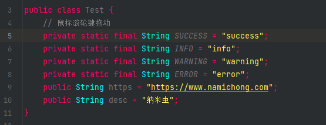
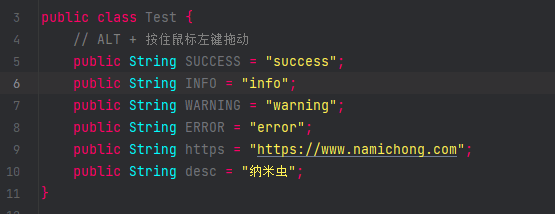
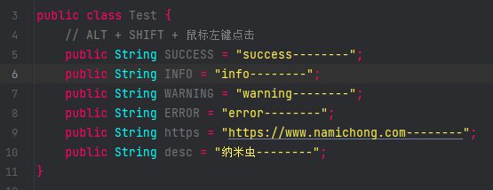
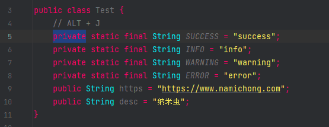
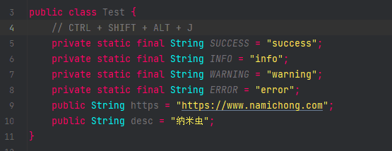

# 多行光标选中并编辑

## 鼠标滚轮键

按住鼠标滚轮键并拖动，选择块内所有文字

## `ALT` + 鼠标左键

按住`ALT`，拖动鼠标左键，选中块内所有文字

## `ALT + SHIFT` + 鼠标左键

按住`ALT + SHIFT`，点击鼠标左键，选中多行文字

## `ALT + J`组合键

选中一个字词，按下`ALT + J`组合键，可依次选中相同的字词

## `CTRL + SHIFT + ALT + J`组合键

选中一个字词，按下`CTRL + SHIFT + ALT + J`组合键，可一次性选中所有相同的字词

