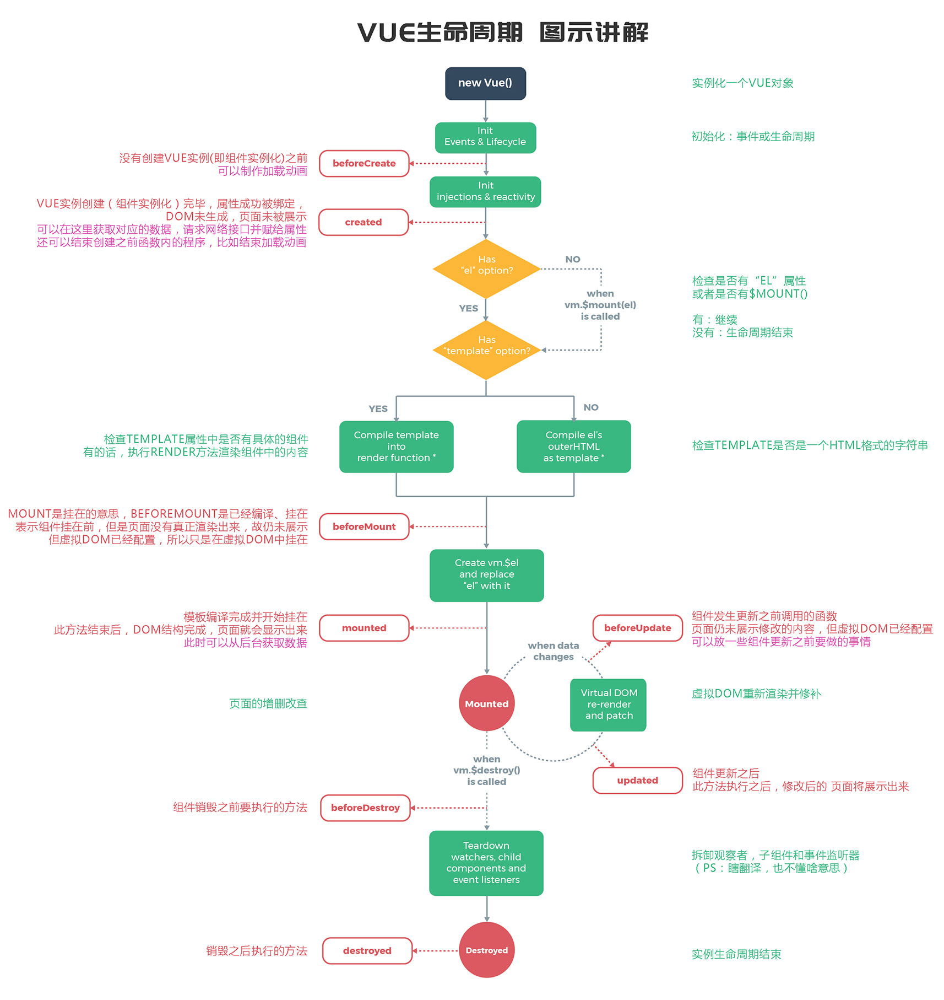

# Vue的生命周期

## 生命周期是什么

生命周期`（Life Cycle）`的概念应用很广泛，特别是在政治、经济、环境、技术、社会等诸多领域经常出现，其基本涵义可以通俗地理解为“从摇篮到坟墓”`（Cradle-to-Grave）`
的整个过程在`Vue`中实例从创建到销毁的过程就是生命周期，即指从创建、初始化数据、编译模板、挂载`Dom`
→渲染、更新→渲染、卸载等一系列过程我们可以把组件比喻成工厂里面的一条流水线，每个工人（生命周期）站在各自的岗位，当任务流转到工人身边的时候，工人就开始工作

PS：在`Vue2`生命周期钩子会自动绑定 `this` 上下文到实例中，因此你可以访问数据，对 `property`
和方法进行运算这意味着你不能使用箭头函数来定义一个生命周期方法 (例如 `created: () => this.fetchTodos()`)

## 生命周期有哪些

`Vue`生命周期总共可以分为8个阶段：创建前后, 载入前后,更新前后,销毁前销毁后，以及一些特殊场景的生命周期

|     生命周期      |           描述            |
|:-------------:|:-----------------------:|
| beforeCreate  |        组件实例被创建之初        |
|    created    |       组件实例已经完全创建        |
|  beforeMount  |         组件挂载之前          |
|    mounted    |       组件挂载到实例上去之后       |
| beforeUpdate  |      组件数据发生变化，更新之前      |
|    updated    |        组件数据更新之后         |
| beforeDestroy |        组件实例销毁之前         |
|   destroyed   |        组件实例销毁之后         |
|   activated   |  `keep-alive` 缓存的组件激活时  |
|  deactivated  | `keep-alive` 缓存的组件停用时调用 |
| errorCaptured |    捕获一个来自子孙组件的错误时被调用    |

## 生命周期整体流程

<vSetup/>
