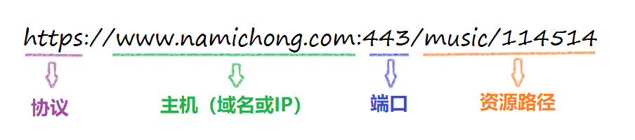

# 什么是跨域？如何解决跨域问题？

## 跨域是什么

跨域本质是浏览器基于**同源策略**的一种安全手段

同源策略（`Sameoriginpolicy`），是一种约定，它是浏览器最核心也最基本的安全功能

所谓同源（即指在同一个域）具有以下三个相同点

- 协议相同（`protocol`）
- 主机相同（`host`）
- 端口相同（`port`）



反之非同源请求，也就是协议、端口、主机其中一项不相同的时候，这时候就会产生跨域

> 一定要注意跨域是浏览器的限制，你用抓包工具抓取接口数据，是可以看到接口已经把数据返回回来了，只是浏览器的限制，你获取不到数据。
> 用`postman`请求接口能够请求到数据。这些再次印证了跨域是浏览器的限制。

## 示例

|               URL               |               被请求的URL                | 是否跨域 |            原因             |
|:-------------------------------:|:------------------------------------:|:----:|:-------------------------:|
| https://www.namichong.com/index |    http://www.namichong.com/index    |  跨域  |           协议不同            |
| https://www.namichong.com/index |     https://namichong.com/index      |  跨域  |           子域名不同           |
| https://www.namichong.com/index |     https://www.texthub.cn/index     |  跨域  |           主域名不同           |
| https://www.namichong.com/index | https://www.namichong.com:8080/index |  跨域  | 端口不同（http默认80，https默认443） |
| https://www.namichong.com/index |    https://www.namichong.com/home    | 不跨域  |            同源             |

## 如何解决跨域

解决跨域的方法有很多，例如：`CORS`、`Proxy`、`JSONP` 等等

其中最常用的方式为`CORS`、`Proxy`这两种，下面，我们主要针对`CORS`或`Proxy`这两种方案进行展开

### 1. CORS

`CORS` （`Cross-Origin Resource Sharing`，跨域资源共享）是一个系统，它由一系列传输的`HTTP`头组成，这些`HTTP`头决定浏览器是否阻止前端 `JavaScript` 代码获取跨域请求的响应

`CORS` 实现起来非常方便，只需要增加一些 `HTTP` 头，让服务器能声明允许的访问来源

只要后端实现了 `CORS`，就实现了跨域


举两个例子：

- KOA框架

```js{2,4}
app.use(async (ctx, next)=> {
  ctx.set('Access-Control-Allow-Origin', '*');
  ctx.set('Access-Control-Allow-Headers', 'Content-Type, Content-Length, Authorization, Accept, X-Requested-With , yourHeaderFeild');
  ctx.set('Access-Control-Allow-Methods', 'PUT, POST, GET, DELETE, OPTIONS');
  if (ctx.method == 'OPTIONS') {
    ctx.body = 200; 
  } else {
    await next();
  }
})
```

- express框架

```js{2-6}
app.all("*", (req, res, next) => {
    res.header("Access-Control-Allow-Origin", "*");
    res.header(
        "Access-Control-Allow-Methods",
        "PUT, GET, POST, DELETE, OPTIONS"
    );
    res.header("Access-Control-Allow-Headers", "X-Requested-With");
    res.header("Access-Control-Allow-Headers", "Content-Type");
    next();
});
```

这两个都是设置了`Access-Control-Allow-Origin`和`Access-Control-Allow-Methods`，从而实现跨域

> <Badge type="warning" text="PS"/> `Access-Control-Allow-Origin` 设置为`*`其实意义不大，可以说是形同虚设，实际应用中，上线前我们会将`Access-Control-Allow-Origin` 值设为我们目标`host`

### 2. Proxy

代理（`Proxy`）也称网络代理，是一种特殊的网络服务，允许一个（一般为客户端）通过这个服务与另一个网络终端（一般为服务器）进行非直接的连接。
一些网关、路由器等网络设备具备网络代理功能。一般认为代理服务有利于保障网络终端的隐私或安全，防止攻击

举三个例子：

- 在`Vue`中配置

如果是通过`vue-cli`脚手架工具搭建项目，我们可以通过`webpack`为我们起一个本地服务器作为请求的代理对象

通过该服务器转发请求至目标服务器，得到结果再转发给前端，但是最终发布上线时如果`web`应用和接口服务器不在一起仍会跨域

在`vue.config.js`文件，新增以下代码

```js{5-13}
amodule.exports = {
    devServer: {
        host: '127.0.0.1',
        port: 8084,
        proxy: {
            '/api': { // '/api'是代理标识，用于告诉node，url前面是/api的就是使用代理的
                target: "http://xxx.xxx.xx.xx:8080", //目标地址，一般是指后台服务器地址
                changeOrigin: true, //是否跨域
                pathRewrite: { // pathRewrite 的作用是把实际Request Url中的'/api'用""代替
                    '^/api': "" 
                }
            }
        }
    }
}
```

通过`axios`发送请求中，配置请求的根路径

```js
axios.defaults.baseURL = '/api'
```

- express框架

```js{5}
var express = require('express');
const proxy = require('http-proxy-middleware')
const app = express()
app.use(express.static(__dirname + '/'))
app.use('/api', proxy({ target: 'http://localhost:4000', changeOrigin: false}));
module.exports = app
```

- 在`Nginx`中配置

```shell{9-15}
server {
    listen    80;
    server_name www.namichong.com;
    location / {
        root  /var/www/html;
        index  index.html index.htm;
        try_files $uri $uri/ /index.html;
    }
    location /api {
        proxy_pass  http://127.0.0.1:3000;
        proxy_redirect   off;
        proxy_set_header  Host       $host;
        proxy_set_header  X-Real-IP     $remote_addr;
        proxy_set_header  X-Forwarded-For  $proxy_add_x_forwarded_for;
    }
}
```

<vPageTips :links="[
    {
        text: '面试官：Vue项目中你是如何解决跨域的呢？',
        links: 'https://vue3js.cn/interview/vue/cors.html'
    },
]"/>
