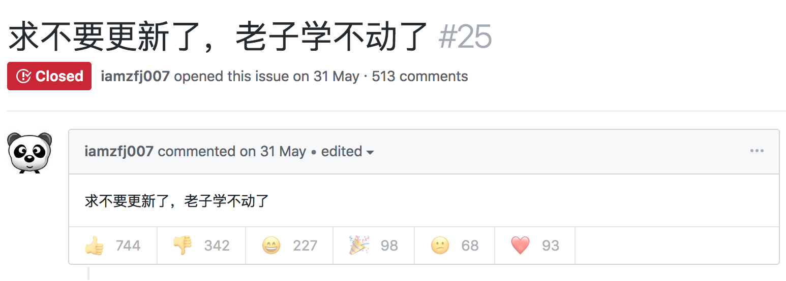

#  别抱着你那陈旧的破技术不放，赶紧学点新玩意吧

现在年轻人的精神状态：

{style="width: 600px"}

额~~~

好像确实应该这样（乐），但是：

------

兄弟，醒醒吧！别再捧着你那几行过时的代码当宝贝了，世界早就变了。你还想着那块“古董”能带你飞？不可能的！
现在是AI、量子计算、云服务的天下，而你却还在死守那些“经典”教程，像个考古学家，盯着那堆发霉的旧技术不放，结果自己已经被时代远远甩在后头。

你说你能用这些老工具，那也只能在原地打转。你看到别人开着飞车飞天，而你却依旧在泥地里慢吞吞地走。你不觉得可笑吗？
你那点技术就像过期的腊肉，怎么煮都做不成美味火锅。
再不动手，你就会在信息的浪潮里被淘汰，成了“数字僵尸”，只有望洋兴叹。

别再对着那堆陈旧的技术做精神安慰了！
赶紧丢掉那块碎裂的“古董”，去学点新东西！
那些新工具、新AI，虽然一开始你可能一头雾水，但正是这份“未知”才会激发你探索的动力。
学点新玩意儿，给自己换个全新的“赛博精神”，打开一个全新的世界。

你再不跟上，时代就会把你遗忘。别做那个停滞不前的“过时人物”，去拥抱那些你不懂的未来，学点新东西，换个新方向吧！

-----

-
-
-
-
-
-
-

**停停停，你不会以为我真能说出这么豪情壮志的话吧，我有这文采吗？不可能哒！😭这都是 AI 写的...**

我就是条咸鱼，只不过有时候闲的蛋疼，想捣鼓一下新技术罢了（当然，只限于自己感兴趣的），至于其他...

